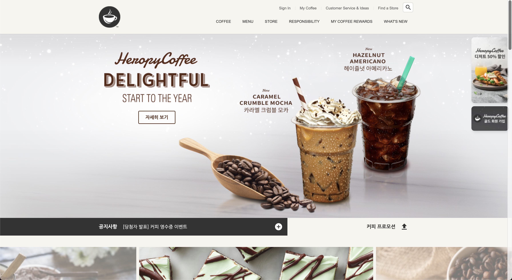
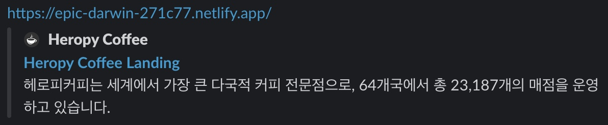
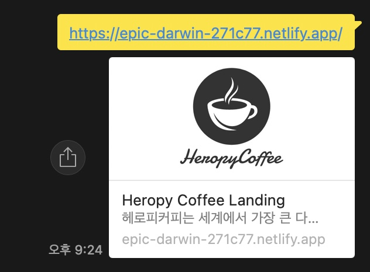

[](https://app.netlify.com/sites/epic-darwin-271c77/deploys)

# ☕ HEROPY COFFEE

헤로피커피 랜딩 페이지(홈페이지)를 만드는 예제입니다.<br>
꼭 ⬇ 아래 내용 모두 읽어보시고, ⬆ 완성된 코드도 확인해 보세요!

[DEMO](https://epic-darwin-271c77.netlify.app/)  
[DEMO/signin](https://practical-ritchie-d283cb.netlify.app/signin/)



## 문자 인코딩(Character Encoding) 설정

문자가 인코딩되는 방식을 설정합니다.

```html
<meta charset="UTF-8"/>
```

- `UTF-8`: 초성, 중성, 종성으로 구분하여 문자를 작성(권장)
- `EUC-KR`: 하나의 완성된 글자를 인식

## 뷰포트(Viewport) 렌더링 방식 설정

웹페이지가 화면(Viewport)에 표현되는 방식을 설정합니다.<br>
모바일 환경에서 적용됩니다.

```html
<meta name="viewport" content="width=device-width, initial-scale=1.0" />
```

- `width=device-width`: 화면의 가로 너비를 각 디바이스(Device)의 가로 너비와 동일하게 적용
- `initial-scale=1.0`: 화면의 초기 화면 배율(확대 정도)을 설정
- `user-scalable=no`: 사용자가 디바이스 화면을 확대(`yes`)/축소(`no`)할 수 있는지 설정
- `maximum-scale=1`: 사용자가 화면을 확대할 수 있는 최댓값
- `minimum-scale=1`: 사용자가 화면을 축소할 수 있는 최솟값

## Favicon(파비콘, favorites icon)

웹페이지를 나타내는 아이콘, 웹페이지의 로고를 설정합니다.<br>
대부분의 경우 루트 경로에 `favicon.ico` 파일을 위치하면 자동으로 로딩하기 때문에 `<link />` 를 작성할 필요가 없습니다.
`favicon.png` 파일을 사용하려면 다음과 같이 `<link />`를 작성하세요.

> 파비콘 이미지는 루트 경로에 있어야 합니다!

```html
<!--<link rel="shortcut icon" href="favicon.ico" />-->
<link rel="icon" href="./favicon.png" />
```

- `favicon.ico` 64 x 64 (px) 또는 32 x 32 또는 16 x 16
- `favicon.png` 500 x 500 (px)

  


### .ico 파일 제작

이미지를 업로드하면 손쉽게 `.ico` 파일을 제작할 수 있습니다.

[iconifier.net](https://iconifier.net/)

## Reset.css

각 브라우저의 기본 스타일을 초기화합니다.

```html
<link rel="stylesheet" href="https://cdn.jsdelivr.net/npm/reset-css@5.0.1/reset.min.css" />
```

## 오픈 그래프(The Open Graph protocol)

웹페이지가 소셜 미디어(페이스북 등)로 공유될 때 우선적으로 활용되는 정보를 지정합니다.

Slack -



KakaoTalk -



[더 많은 오픈 그래프 속성 보기](https://ogp.me/)

```html
<meta property="og:type" content="website" />
<meta property="og:site_name" content="Heropy Coffee" />
<meta property="og:title" content="Heropy Coffee Landing" />
<meta property="og:description" content="헤로피커피는 세계에서 가장 큰 다국적 커피 전문점으로, 64개국에서 총 23,187개의 매점을 운영하고 있습니다." />
<meta property="og:image" content="./images/for_seo.jpg" />
<meta property="og:url" content="https://epic-darwin-271c77.netlify.app" />
```

- `og:type`: 페이지의 유형(E.g, `website`, `video.movie`)
- `og:site_name`: 속한 사이트의 이름
- `og:title`: 페이지의 이름(제목)
- `og:description`: 페이지의 간단한 설명
- `og:image`: 페이지의 대표 이미지 주소(URL)
- `og:url`: 페이지 주소(URL)

## 트위터 카드(Twitter Cards)

웹페이지가 소셜 미디어(트위터)로 공유될 때 우선적으로 활용되는 정보를 지정합니다.

[더 많은 트위터 카드 보기](https://developer.twitter.com/en/docs/twitter-for-websites/cards/guides/getting-started)

```html
<meta property="twitter:card" content="summary" />
<meta property="twitter:site" content="Heropy Coffeee" />
<meta property="twitter:title" content="Heropy Coffee Landing" />
<meta property="twitter:description" content="헤로피커피는 세계에서 가장 큰 커피 전문점으로, 64개국에서 총 23,187개의 매점을 운영하고 있습니다." />
<meta property="twitter:image" content="./images/for_seo.jpg" />
<meta property="twitter:url" content="https://epic-darwin-271c77.netlify.app" />
```

- `twitter:card`: 페이지(카드)의 유형(E.g. `summary`, `player`)
- `twitter:site`: 속한 사이트의 이름
- `twitter:title`: 페이지의 이름(제목)
- `twitter:description`: 페이지의 간단한 설명
- `twitter:image`: 페이지의 대표 이미지 주소(URL)
- `twitter:url`: 페이지 주소(URL)

## Google Fonts

페이지에서 사용할 '나눔고딕' 폰트를 지정합니다.

> 폰트 라이선스를 꼭 확인해야 합니다!

[Google Fonts](https://fonts.google.com/)에서 고른 폰트 파일을 가져옵니다.

```html
<link rel="preconnect" href="https://fonts.googleapis.com" />
<link rel="preconnect" href="https://fonts.gstatic.com" crossorigin />
<link href="https://fonts.googleapis.com/css2?family=Nanum+Gothic:wght@400;700&display=swap" rel="stylesheet" />
```

페이지에 폰트를 적용합니다.
CSS 글자/문자 관련 속성은 상속(inherit)됩니다.

```css
body {
    font-family: 'Nanum Gothic', sans-serif;
}
```

## Google Material Icons

[구글에서 제공하는 머터리얼 아이콘](https://material.io/resources/icons/?style=baseline)을 무료로 사용할 수 있습니다.

[Getting started for web](https://material.io/develop/web/getting-started)

```html
<link rel="stylesheet" href="https://fonts.googleapis.com/icon?family=Material+Icons" />
```

다음과 같이 사용할 수 있습니다.

```html
<div class="material-icons">upload</div>
```

## GSAP & ScrollToPlugin

[GSAP(The GreenSock Animation Platform)](https://greensock.com/gsap/)은 자바스크립트로 제어하는 타임라인 기반의 애니메이션 라이브러리입니다.
[ScrollToPlugin](https://greensock.com/scrolltoplugin/)은 스크롤 애니메이션을 지원하는 GSAP 플러그인입니다.

> 자바스크립트 지식이 충분하지 않아도 쉽게 사용할 수 있습니다!

```html
<script src="https://cdnjs.cloudflare.com/ajax/libs/gsap/3.9.1/gsap.min.js" integrity="sha512-H6cPm97FAsgIKmlBA4s774vqoN24V5gSQL4yBTDOY2su2DeXZVhQPxFK4P6GPdnZqM9fg1G3cMv5wD7e6cFLZQ==" crossorigin="anonymous" referrerpolicy="no-referrer"></script>
<script src="https://cdnjs.cloudflare.com/ajax/libs/gsap/3.9.1/ScrollToPlugin.min.js" integrity="sha512-agNfXmEo6F+qcj3WGryaRvl9X9wLMQORbTt5ACS9YVqzKDMzhRxY+xjgO45HCLm61OwHWR1Oblp4QSw/SGh9SA==" crossorigin="anonymous" referrerpolicy="no-referrer"></script>
```

[.to() 사용법](https://greensock.com/docs/v3/GSAP/gsap.to())  
[GSAP Easing](https://greensock.com/docs/v3/Eases)

```js
gsap.to(요소, 시간, 옵션)
```

```js
gsap.to(window, .7, {
  scrollTo: 0
});
```

## Swiper

[Swiper](https://swiperjs.com/)는 하드웨어 가속 전환과 여러 기본 동작을 갖춘 현대적인 슬라이드 라이브러리입니다.

[Getting Started With Swiper](https://swiperjs.com/get-started)

```html
<!-- in HEAD -->
<link rel="stylesheet" href="https://unpkg.com/swiper@7/swiper-bundle.min.css" />
<script src="https://unpkg.com/swiper@7/swiper-bundle.min.js"></script>

<!-- in BODY -->
<div class="swiper">
  <div class="swiper-wrapper">
    <div class="swiper-slide">1</div>
    <div class="swiper-slide">2</div>
    <div class="swiper-slide">3</div>
  </div>
</div>
```

[Swiper API](https://swiperjs.com/swiper-api)(옵션)을 확인하세요!

```js
new Swiper(요소, 옵션);
```

```js
new Swiper('.swiper', {
  direction: 'vertical', // 수직 슬라이드
  autoplay: true, // 자동 재생 여부
  loop: true // 반복 재생 여부
});
```

## Youtube API

[IFrame Player API](https://developers.google.com/youtube/iframe_api_reference?hl=ko)를 통해 YouTube 동영상을 제어할 수 있습니다.

유튜브 영상이 출력될 위치에 요소를 지정(생성)합니다.

```html
<!-- in HEAD -->
<script defer src="./js/youtube.js"></script>

<!-- in BODY -->
<div id="player"></div>
```

`onYouTubePlayerAPIReady` 함수 이름은 Youtube IFrame Player API에서 사용하는 이름이기 때문에 다르게 지정하면 동작하지 않습니다!<br>
그리고 함수는 전역(Global) 등록해야 합니다!

[플레이어 매개변수(playerVars)](https://developers.google.com/youtube/player_parameters.html?playerVersion=HTML5&hl=ko#Parameters)에서 더 많은 옵션을 확인할 수 있습니다.

```js
// Youtube IFrame API를 비동기로 로드합니다.
var tag = document.createElement('script');

tag.src = "https://www.youtube.com/iframe_api";
var firstScriptTag = document.getElementsByTagName('script')[0];
firstScriptTag.parentNode.insertBefore(tag, firstScriptTag);

function onYouTubeIframeAPIReady() {
  new YT.Player('player', {
    videoId: 'Tdwetb0Mvyc', // 최초 재생할 유튜브 영상 ID
    playerVars: {
      autoplay: true, // 자동 재생 유무
      loop: true, // 반복 재생 유무
      playlist: 'Tdwetb0Mvyc' // 반복 재생할 유튜브 영상 ID 목록
    },
    events: {
      // 영상이 준비되었을 때,
      onReady: function (event) {
        event.target.mute() // 음소거!
      }
    }
  });
}
```

## ScrollMagic

[ScrollMagic](https://github.com/janpaepke/ScrollMagic)은 스크롤과 요소의 상호 작용을 위한 자바스크립트 라이브러리입니다.<br>
대표적으로 어떤 요소가 현재 화면에 보이는 상태인지를 확인할 때 사용합니다.

[ScrollMagic API](http://scrollmagic.io/docs/)

```html
<script src="https://cdnjs.cloudflare.com/ajax/libs/ScrollMagic/2.0.8/ScrollMagic.min.js" integrity="sha512-8E3KZoPoZCD+1dgfqhPbejQBnQfBXe8FuwL4z/c8sTrgeDMFEnoyTlH3obB4/fV+6Sg0a0XF+L/6xS4Xx1fUEg==" crossorigin="anonymous" referrerpolicy="no-referrer"></script>
```

```js
new ScrollMagic
  .Scene({ // 감시할 장면(Scene)을 추가
    triggerElement: spyEl, // 보여짐 여부를 감시할 요소를 지정
    triggerHook: .8 // 화면의 80% 지점에서 보여짐 여부 감시
  })
  .setClassToggle(spyEl, 'show') // 요소가 화면에 보이면 show 클래스 추가
  .addTo(new ScrollMagic.Controller()) // 컨트롤러에 장면을 할당(필수!)
```

## Header 메인 메뉴

```html
<ul class="main-menu">
  <li class="item">
    <div class="item__name">COFFEE</div>
    <div class="item__contents">
      <div class="contents__menu">
        <ul class="inner">
          <li>
            <h4>커피</h4>
            <ul>
              <li>헤로피커피 원두</li>
              <li>헤로피커피 비아</li>
              <li>헤로피커피 오리가미</li>
            </ul>
          </li>
          <li>
            <h4>에스프레소 음료</h4>
            <ul>
              <li>도피오</li>
              <li>에스프레소 마키아또</li>
              <li>아메리카노</li>
              <li>마키아또</li>
              <li>카푸치노</li>
              <li>라떼</li>
              <li>모카</li>
              <li>리스트레또 비안코</li>
            </ul>
          </li>
          <li>
            <h4>커피 이야기</h4>
            <ul>
              <li>로스트 스팩트럼</li>
              <li>최상의 아라비카 원두</li>
              <li>한 잔의 커피가 완성되기까지</li>
              <li>클로버 커피 추출 시스템</li>
            </ul>
          </li>
          <li>
            <h4>최상의 커피를 즐기는 법</h4>
            <ul>
              <li>커피 프레스</li>
              <li>푸어 오버</li>
              <li>아이스 푸어 오버</li>
              <li>커피 메이커</li>
              <li>리저브를 매장에서 다양하게 즐기는 법</li>
            </ul>
          </li>
        </ul>
      </div>
      <div class="contents__texture">
        <div class="inner">
          <h4>나와 어울리는 커피 찾기</h4>
          <p>여러분에게 어울리는 커피를 찾아드립니다.</p>
          <h4>최상의 커피를 즐기는 법</h4>
          <p>여러가지 방법을 통해 다양한 풍미의 커피를 즐겨보세요.</p>
        </div>
      </div>
    </div>
  </li>
  <li class="item">
    <div class="item__name">MENU</div>
    <div class="item__contents">
      <div class="contents__menu">
        <ul class="inner">
          <li>
            <h4>음료</h4>
            <ul>
              <li>콜드 브루</li>
              <li>브루드 커피</li>
              <li>에스프레소</li>
              <li>프라푸치노</li>
              <li>블렌디드 음료</li>
              <li>헤로피커피 피지오</li>
              <li>티(티바나)</li>
              <li>기타 제조 음료</li>
              <li>주스(병음료)</li>
            </ul>
          </li>
          <li>
            <h4>푸드</h4>
            <ul>
              <li>베이커리</li>
              <li>케익</li>
              <li>샌드위치 & 샐러드</li>
              <li>따뜻한 푸드</li>
              <li>과일 & 요거트</li>
              <li>스낵 & 미니 디저트</li>
              <li>아이스크림</li>
            </ul>
          </li>
          <li>
            <h4>상품</h4>
            <ul>
              <li>머그</li>
              <li>글라스</li>
              <li>플라스틱 텀블러</li>
              <li>스테인리스 텀블러</li>
              <li>보온병</li>
              <li>액세서리</li>
              <li>커피 용품</li>
              <li>패키지 티(티바나)</li>
            </ul>
          </li>
          <li>
            <h4>카드</h4>
            <ul>
              <li>실물카드</li>
              <li>e-Gift 카드</li>
            </ul>
          </li>
          <li>
            <h4>메뉴 이야기</h4>
            <ul>
              <li>콜드 브루</li>
              <li>티바나</li>
            </ul>
          </li>
        </ul>
      </div>
      <div class="contents__texture">
        <div class="inner">
          <h4>티바나</h4>
          <p>다양한 찻잎과 향신료 등 개성있는 재료로 새로운 맛과 향의 티를 선보입니다.</p>
        </div>
      </div>
    </div>
  </li>
  <li class="item">
    <div class="item__name">STORE</div>
    <div class="item__contents">
      <div class="contents__menu">
        <ul class="inner">
          <li>
            <h4>매장 찾기</h4>
            <ul>
              <li>퀵 검색</li>
              <li>지역 검색</li>
              <li>My 매장</li>
            </ul>
          </li>
          <li>
            <h4>매장 이야기</h4>
            <ul>
              <li>청담스타</li>
              <li>티바나 인스파이어드 매장</li>
              <li>파미에파크</li>
            </ul>
          </li>
        </ul>
      </div>
      <div class="contents__texture">
        <div class="inner">
          <h4>매장 찾기</h4>
          <p>보다 빠르게 매장을 찾아보세요.</p>
          <h4>청담스타</h4>
          <p>헤로피커피 1,000호점인 청담스타점을 만나보세요.</p>
        </div>
      </div>
    </div>
  </li>
  <li class="item">
    <div class="item__name">RESPONSIBILITY</div>
    <div class="item__contents">
      <div class="contents__menu">
        <ul class="inner">
          <li>
            <h4>지역 사회 참여 활동</h4>
            <ul>
              <li>회망배달 캠페인</li>
              <li>재능기부 카페 소식</li>
              <li>커뮤니티 스토어</li>
              <li>청년인재 양성</li>
              <li>우리 농산물 사랑 캠페인</li>
              <li>우리 문화 지키기</li>
            </ul>
          </li>
          <li>
            <h4>환경보호 활동</h4>
            <ul>
              <li>환경 발자국 줄이기</li>
              <li>일회용 컵 없는 매장</li>
              <li>커피 원두 재활용</li>
            </ul>
          </li>
          <li>
            <h4>윤리 구매</h4>
            <ul>
              <li>윤리적 원두 구매</li>
              <li>공정무역 인증</li>
              <li>커피 농가 지원 활동</li>
            </ul>
          </li>
          <li>
            <h4>글로벌 사회 공헌</h4>
            <ul>
              <li>윤리경영 보고서</li>
              <li>헤로피커피 재단</li>
              <li>지구촌 봉사의 달</li>
            </ul>
          </li>
        </ul>
      </div>
      <div class="contents__texture">
        <div class="inner">
          <h4>커피원두 재활용</h4>
          <p>헤로피커피 커피 원두를 재활용 해보세요.</p>
        </div>
      </div>
    </div>
  </li>
  <li class="item">
    <div class="item__name">MY COFFEE REWARDS</div>
    <div class="item__contents">
      <div class="contents__menu">
        <ul class="inner">
          <li>
            <h4>마이 헤로피커피 리워즈</h4>
            <ul>
              <li>마이 리워즈 소개</li>
              <li>등급 및 혜택</li>
              <li>헤로피커피 별</li>
              <li>자주하는 질문</li>
            </ul>
          </li>
          <li>
            <h4>헤로피커피 카드</h4>
            <ul>
              <li>카드 소개</li>
              <li>카드 갤러리</li>
              <li>등록 및 조회</li>
              <li>충전 및 이용안내</li>
              <li>분실신고/환불신청</li>
              <li>자주하는 질문</li>
            </ul>
          </li>
          <li>
            <h4>카드 e-Gift</h4>
            <ul>
              <li>카드 e-Gift 소개</li>
              <li>이용안내</li>
              <li>선물하기</li>
              <li>자주하는 질문</li>
            </ul>
          </li>
        </ul>
      </div>
      <div class="contents__texture">
        <div class="inner">
          <h4>카드 등록하기</h4>
          <p>카드 등록 후 리워즈 서비스를 누리고 사용내역도 조회해보세요.</p>
        </div>
      </div>
    </div>
  </li>
  <li class="item">
    <div class="item__name">WHAT'S NEW</div>
    <div class="item__contents">
      <div class="contents__menu">
        <ul class="inner">
          <li>
            <h4>프로모션 & 이벤트</h4>
            <ul>
              <li>전체</li>
              <li>카드</li>
              <li>마이 리워즈</li>
              <li>온라인</li>
              <li>2017 플래너</li>
            </ul>
          </li>
          <li>
            <h4>새소식</h4>
            <ul>
              <li>전체</li>
              <li>상품 출시</li>
              <li>문화</li>
              <li>사회공헌</li>
              <li>카드출시</li>
            </ul>
          </li>
          <li>
            <h4>매장별 이벤트</h4>
            <ul>
              <li>일반 매장</li>
              <li>신규 매장</li>
            </ul>
          </li>
        </ul>
      </div>
      <div class="contents__texture">
        <div class="inner">
          <h4>매장별 이벤트</h4>
          <p>매장 이벤트 정보를 확인 하실 수 있습니다.</p>
          <h4>소셜</h4>
          <p>다양한 SNS 채널을 통해 커피를 만나보세요!</p>
        </div>
      </div>
    </div>
  </li>
</ul>
```
